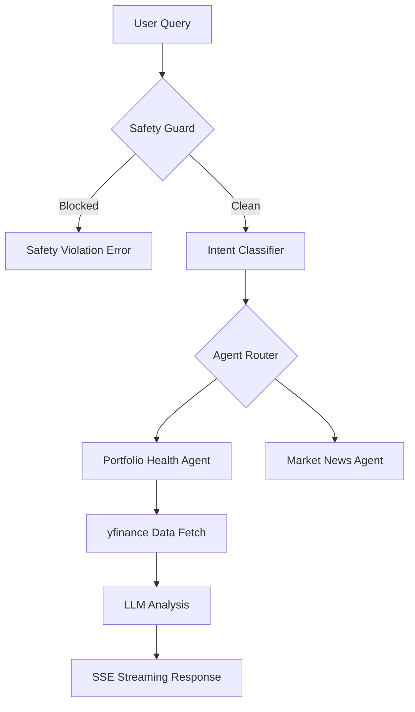

# Co-Investor Microservice 🚀

[](https://fastapi.tiangolo.com/)
[](https://www.python.org/)
[](https://openai.com/)
[](https://opensource.org/licenses/MIT)

**Co-Investor Microservice** is a production-grade, safety-first AI microservice designed to act as an intelligent "co-investor." It processes financial queries through a rigorous pipeline to provide data-backed, real-time insights while ensuring regulatory and ethical compliance.

---

## ✨ Key Features

- 🛡️ **Safety Guard**: High-performance regex-based filtering that blocks malicious financial queries (insider trading, market manipulation) in `<10ms`.
- 🧠 **Intent Intelligence**: Context-aware LLM classification (`GPT-4o-mini`) to extract tickers, amounts, and user goals.
- 📈 **Real-Time Market Data**: Integration with `yfinance` for live stock price and portfolio health analysis.
- ⚡ **SSE Streaming**: Real-time response streaming using Server-Sent Events (SSE) for a smooth, conversational UI experience.
- 🏗️ **Clean Architecture**: Modular, extensible design following DDD principles and modern FastAPI best practices.
- 🧪 **Production Ready**: Structured JSON logging (`structlog`), comprehensive testing, and type-safe schemas.
- 🔌 **Demo Mode (Stub Client)**: A built-in simulator that allows the entire pipeline to run without an OpenAI API key—perfect for offline demos and testing.

---

## 🏗 System Architecture

The request flows through a linear, high-efficiency pipeline:



---

## 🛠 Tech Stack

| Component | Technology | Rationale |
| :--- | :--- | :--- |
| **Backend** | FastAPI | Async performance and native OpenAPI docs. |
| **Streaming** | SSE-Starlette | Standardized, robust Server-Sent Events. |
| **AI Engine** | OpenAI GPT-4o-mini | Optimal balance of intelligence and cost. |
| **Financial Data**| yfinance | Reliable, open-access market data. |
| **Validation** | Pydantic V2 | High-speed data validation and serialization. |
| **Logging** | Structlog | Structured JSON logs for ELK/Datadog compatibility. |

---

## 🚀 Getting Started

### Prerequisites
- Python 3.11+
- OpenAI API Key

### Installation

1. **Clone the repository**:
   ```bash
   git clone https://github.com/your-username/co-investor-microservice.git
   cd co-investor-microservice
   ```

2. **Install dependencies**:
   ```bash
   pip install -r requirements.txt
   ```

3. **Configure Environment**:
   Create a `.env` file:
   ```env
   OPENAI_API_KEY=sk-proj-...
   DEBUG=True
   ENVIRONMENT=development
   ```

### Running the Service

```bash
python -m uvicorn src.main:app --reload
```
The API will be live at `http://localhost:8000`. 

#### 💡 Running in Demo Mode (No API Key Required)
If you don't have an OpenAI API key or want to test the streaming UI offline, you can enable the **Stub Client**:
1. Open `.env`
2. Set `LLM_PROVIDER=stub`
3. Restart the server. The system will now provide simulated, professional financial analyses instantly.

- **Interactive Docs**: [http://localhost:8000/docs](http://localhost:8000/docs)
- **Health Check**: `GET /health`

### 🧪 Testing with the Demo Client
To see the system in action with a live streaming response, we've provided a helper script:

1. Ensure the server is running in one terminal.
2. Open another terminal and run:
   ```bash
   python scripts/demo_client.py
   ```
This script will send a sample query and stream the response directly to your console, demonstrating the real-time SSE capabilities.


---

## 🧪 Quality Assurance

We maintain a high standard of code quality with a full suite of unit and integration tests.

```bash
# Run all tests
python -m pytest

# Run with coverage report
python -m pytest --cov=src
```

---

## 📈 Performance Benchmarks

| Metric | Target |
| :--- | :--- |
| **Safety Filter Latency** | < 10ms |
| **First Token Time (TTFT)** | < 1.5s |
| **End-to-End Latency** | < 5.0s |
| **Test Coverage** | > 90% |

---

## 🎥 Demonstration
[Link to Project Video Placeholder]

---

## 📄 License
This project is licensed under the MIT License - see the [LICENSE](LICENSE) file for details.
